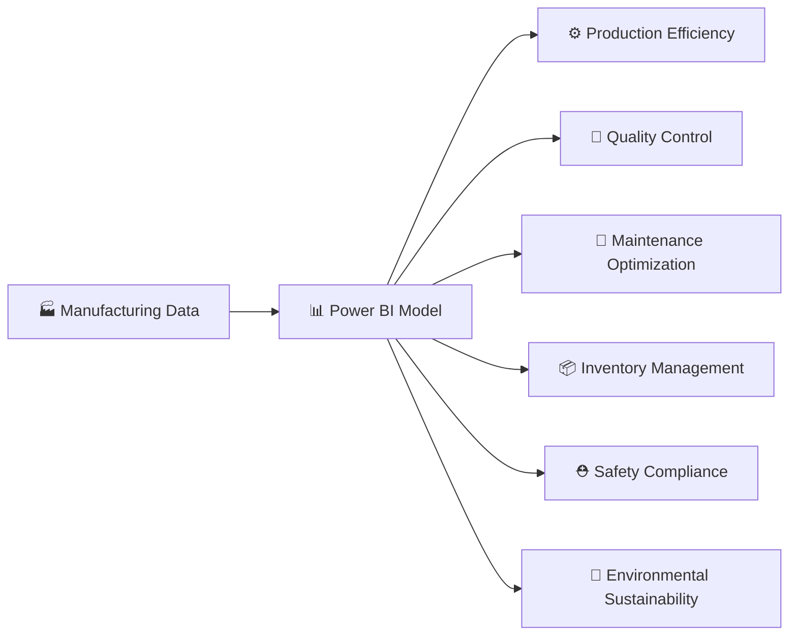

<!-- HEADER BANNER -->
<div align="center">


</div>

<!-- BADGES -->
<div align="center">


</div>

<br/>

---

## 🔍 Project Overview

> **A comprehensive Power BI Manufacturing Intelligence Platform** that transforms raw factory data into actionable insights — covering everything from production efficiency and quality control to safety, cost, and environmental sustainability across multiple facilities and production lines.

This dashboard empowers plant managers, operations teams, and executives to monitor **KPIs in real time**, detect anomalies, reduce costs, and drive continuous improvement — all in one unified, interactive report.

---

## ❗ Problem Solved

Manufacturing operations generate massive volumes of data across disconnected systems — production lines, quality labs, maintenance logs, inventory systems, and environmental monitors. Without a unified view:

- 🔴 **Production inefficiencies** go undetected until it's too late
- 🔴 **Quality defects** cause costly rework and scrap
- 🔴 **Maintenance failures** lead to unplanned downtime
- 🔴 **Safety incidents** lack trend analysis for prevention
- 🔴 **Cost overruns** are identified after-the-fact

This dashboard **solves all of the above** by integrating every data domain into a single star-schema model with real-time slicing, trend analysis, and drill-through capability.

---

## 🛠️ Tools & Technologies

| Category | Technology |
|---|---|
| 📊 **BI Platform** | Microsoft Power BI Desktop |
| 🔢 **Query Language** | DAX (Data Analysis Expressions) |
| 🔄 **Data Transformation** | Power Query (M Language) |
| 🗃️ **Data Modeling** | Star Schema — Fact & Dimension Tables |
| 🎨 **Design** | Custom Theme (CY26SU02), Gradient Backgrounds, AI-generated Visuals |
| 📁 **File Format** | `.pbix` — Power BI Report Bundle |

---

## 📊 Dashboard Pages & Key Visuals

<details>
<summary><b>🏠 1. OVERVIEW — Executive KPI Summary</b></summary>

> The command center. Six KPI cards provide instant health-check visibility.

| Visual | Metric |
|---|---|
| 📌 Card | Total Production Units |
| 📌 Card | Good Units |
| 📌 Card | Defective Units |
| 📌 Card | OEE (Overall Equipment Effectiveness) |
| 📌 Card | Total Cost |
| 📌 Card | Safety Incident Count |
| 📈 Line Chart | Actual Quantity over Time |
| 📊 Clustered Column | Availability / Performance / Quality Rate by Line |
| 📊 Column Chart | Quality Cost by Facility |
| 📊 Bar Chart | Production Volume by Product |

</details>

<details>
<summary><b>⚙️ 2. PRODUCTION — Operational Deep Dive</b></summary>

> Planned vs. actual performance, shift analysis, and downtime breakdown.

- Line Chart: Planned vs. Actual Production Quantity
- Bar Chart: Defective Units, Scrap, Rework by Product
- Pivot Table: OEE by Line × Month
- Bar Chart: Downtime Minutes by Production Line
- Donut Chart: Production Volume by Shift
- Slicer: Production Line Filter

</details>

<details>
<summary><b>🔬 3. QUALITY ANALYTICS — Defect Intelligence</b></summary>

> Root cause analysis, defect classification, and pass/fail trends.

- Donut Chart: Pass vs. Fail Inspection Status
- Column Chart: Critical / Major / Minor Defects by Product
- Area Chart: Total Defect Trend over Time
- Clustered Bar: Root Cause Count by Product
- Pivot Table: Inspection Method × Pass/Fail × Root Cause

</details>

<details>
<summary><b>🔧 4. MAINTENANCE — Equipment Health</b></summary>

> Maintenance cost tracking, downtime root causes, and MTTR monitoring.

- Donut Chart: Maintenance Cost by Type (Preventive / Corrective)
- Line Chart: Maintenance Cost over Time
- Bar Chart: Downtime Minutes by Production Line
- KPI Card: MTTR (Mean Time to Repair)
- Detailed Table: Equipment Type, Line, Year, Month

</details>

<details>
<summary><b>📦 5. INVENTORY DASHBOARD — Supply Chain Visibility</b></summary>

> Stock levels, supplier quality, and work order prioritization.

- Card: Total Inventory Items
- Clustered Column: Allocated / Available / On-Hand / On-Order by Product
- Scatter Chart: Supplier Quality Score vs. Order Quantity by Priority
- Gauge Charts: Target Value Indicators (×3)
- Slicers: Priority, Product, Product Family

</details>

<details>
<summary><b>💰 6. COST ANALYSIS — Financial Performance</b></summary>

> Full cost breakdown and variance analysis across products and lines.

- Column Chart: Raw Material + Labor + Machine + Overhead Cost by Product
- Area Chart: Cost Per Unit by Production Line
- Bar Chart: Cost Variance % by Product
- Donut Chart: Cost Variance Distribution
- Slicers: Product, Production Line

</details>

<details>
<summary><b>⛑️ 7. SAFETY DASHBOARD — Incident Intelligence</b></summary>

> Severity trends, facility-level incident mapping, and days-lost tracking.

- Cards: Incident Count
- Donut Chart: Incidents by Severity Level
- Bar Chart: Incident Count by Facility
- Line Chart: Days Lost over Time
- Gauge: Critical Defect Rate, Defect %
- Scatter: Facility × Incidents × Lower Tolerance

</details>

<details>
<summary><b>🌱 8. ENVIRONMENTAL DASHBOARD — Sustainability Metrics</b></summary>

> Energy consumption, waste management, and sustainability scoring.

- Line Chart: Energy Consumption (kWh) over Time
- Column Chart: Recycled / Landfill / Hazardous Waste by Facility
- KPI Card: Average Sustainability Score
- Combo Chart: Waste Disposal Cost vs. Recycling Revenue by Month

</details>

---

## 🏆 Key Results

```
┌──────────────────────────────────────────────────────────────┐
│                    DASHBOARD OUTCOMES                        │
├──────────────────────────────────────────────────────────────┤
│  ✅  8 Fully Integrated Dashboard Pages                      │
│  ✅  OEE Tracked Across All Production Lines                 │
│  ✅  Root Cause Analysis for Quality Defects                 │
│  ✅  Maintenance Cost Optimization via MTTR Tracking         │
│  ✅  Multi-Facility Safety Incident Monitoring               │
│  ✅  Sustainability Score & Waste Cost Visibility            │
│  ✅  Unified Star Schema Data Model                          │
│  ✅  20+ Custom DAX Measures                                 │
└──────────────────────────────────────────────────────────────┘
```

---

## 🧠 Technical Skills Demonstrated

<div align="center">

| Skill | Description |
|---|---|
| ⚙️ **Data Modeling** | Star schema with fact tables: `fact_daily_production`, `fact_quality_inspection`, `fact_equipment_maintenance`, `fact_production_cost`, `fact_safety_incident`, `fact_environmental_data` |
| 🔢 **DAX Measures** | Custom measures: `OEE`, `Total_Production`, `Good_Units`, `Defective_Units`, `Total_Cost`, `MTTR`, `Cost_Per_Unit`, `Defect_Rate`, `Critical_Defects`, `Root_Cause_Count` |
| 🔄 **Power Query** | Multi-source ingestion, type transformations, relationship normalization |
| 🎨 **UX Design** | Themed visuals, gradient backgrounds, AI-generated imagery, consistent color language |
| 📐 **Report Architecture** | 8-page modular layout with cross-page slicers, drill-throughs, and dynamic titles |
| 🔍 **Analytics** | Trend lines, variance %, scatter analysis, time-intelligence patterns |

</div>

---

## 💼 Business Impact

> This solution directly addresses **6 core manufacturing performance domains**:



| Domain | Business Value |
|---|---|
| **Production** | Identify output gaps vs. plan; optimize shift scheduling |
| **Quality** | Reduce scrap/rework costs; trace defects to root cause |
| **Maintenance** | Shift from reactive to predictive maintenance |
| **Inventory** | Prevent stockouts and overstock; evaluate supplier reliability |
| **Cost** | Pinpoint cost overruns by product line or overhead type |
| **Safety & Environment** | Track compliance KPIs; reduce liability and waste costs |

---

## 📁 Project Structure

```
Manufacturing_Dashboard.pbix
├── 📄 Report/Layout          → 8 dashboard page definitions
├── 🗃️ DataModel              → Star schema with 10+ tables
├── 🖼️ StaticResources        → Custom background images & theme
├── ⚙️ Settings               → Report configuration
└── 🔐 SecurityBindings       → Row-level security (if applied)
```

---

<div align="center">


**Built with ❤️ using Power BI** · *Transforming factory data into manufacturing intelligence*

</div>
